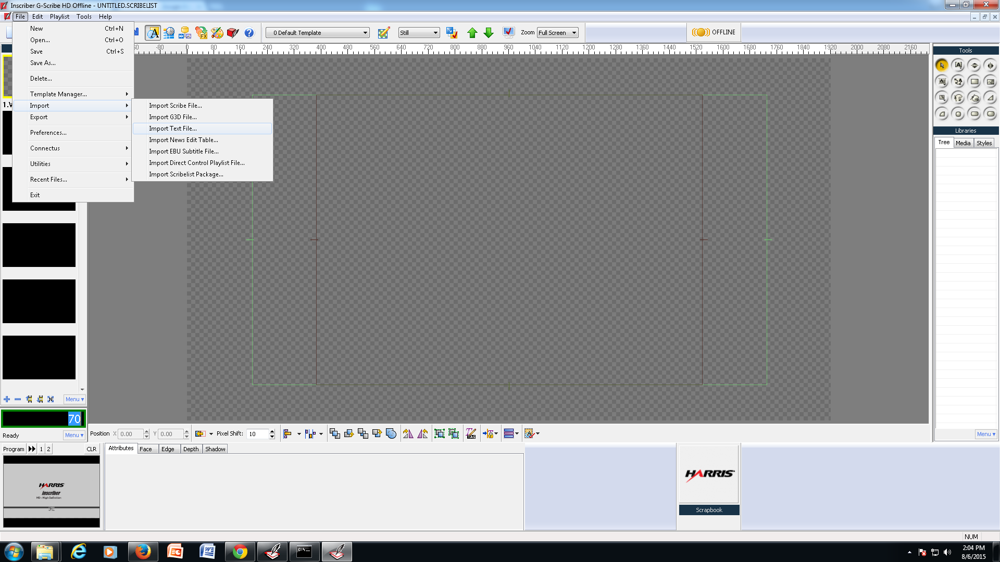

What is the Inscriber and when do we use it?
============================================

The inscriber is a computer application we use at PCN to create the
Lower third graphics. The inscriber is located on computers in Master
Control, Studio Control, Edit 2 and one computer upstairs in Edit 1. To
open the Gscribe Inscriber Application double click on the icon with a
feather on
it.

RTX tags what are they?
=======================

RTX tags are used in gscribe inscriber to differentiate the different
text layers. The tags that we use at PCN are listed below.

template=1 Long Lines (Topics, Locations)

a 1L=

b 2L Top=

c 2L Bottom=

d 3L Top=

e 3L Middle=

f 3L Bottom=

g 2L Info=

h 3L Info=

Flag=

template=1 refers to the template number.

a 1L= One liner use this for one line graphics.

b 2L Top= 2 line graphic top line.

c 2L Bottom= 2 line graphic second line.

d 3L Top= 3 line graphic first line

e 3L Middle= 3 line graphic second line

f 3L Bottom= 3 line graphic third line

g 2L Info= 2 line info graphic (expands to second line)

h 3L Info= 3 line info graphic (expands to three lines)

Flag= text for Flag ontop of lower third bar. Used with House and Senate
Bill graphics

How to type graphics using text files.
======================================

-   Navigate to N:\\Public Affairs

-   Open the file TEMPLATE PUBLIC AFFAIRS.txt for public affairs or
    > TEMPLATE Election.txt if it is an election program

-   At the top of the file Type in name of program that was
    > videorecorded, the date of the program and your initials

Select template to use Template 1 if your graphic is long in length,
Select template 2 for a person's name.

File in your graphic with the correct RTX tags, for each name.

example

d 3L Top=John Smith

e 3L Middle=Big Time Company

f 3L Bottom= CEO

-   Type all graphics

-   Delete any unused templates

-   Delete any unused lines

-   Add any saved graphics from directory at the bottom

-   Any Contact Information will be added after the saved graphics

Save as: Shoot date and Name of Program- Example: 07.20.15 Health
Hearing

Save the file in the correct month in the public affairs. If this is a
specific series show use the series folder on the N drive.

Inscriber Interface
===================

The Gscribe Inscriber is made up of 7 different programs. For basic
Inscriber work you will only use 2 of these programs the CG and Quick
Edit.

Typing graphics with CG and Quick Edit
======================================

Select template
---------------

· Click on the drop down menu (top middle of screen), or Recall the
Template
Number

· Click the "Quick Edit" (Shift F7 or the red box icon with a feather)

· On the right hand side click on the line you want to update. The RTX
tag corresponds to different text layers. 1L is for One Liners.

· When you type in the graphic you will see it updating on the left hand
side of the screen

· Enter number that you want to save the graphic at with the number
keyboard on the right.

· Press F5 to record the graphic, or if you have a rapid fire keyboard
press record

· To return to the Canvas hit F6 or use mouse to click on the A icon at
the top.

Recalling graphics in the Directory
===================================

Using the rapid fire keyboard, type in the number of the graphic you
want to update. Press the Take button at the bottom right of the
keyboard. The graphic should preview on the screen in front of you.
Press the Take button again to transfer the graphic online.

If you are not using a regular keyboard, type in the number with the
numberpad. Press the Enter key to preview the graphic on the screen.

Playlists
=========

Inscriber uses playlists to load a number of graphics. Everytime you
open up the Inscriber it will automatically create a new playlist. You
can load graphics into your playlist. The playlist is different from the
directory because it contains temporary graphics that you are loading or
using now. The directory contains saved graphics that we use all the
time. We use the directory to save the names of the Representatives or
Senators and their districts. If the person we are fonting is new to PCN
or on rarely their name would be in a playlist not the directory.

Changing the Directory Primary Mode and Secondary Mode.
=======================================================

If you are typing in the graphic number and nothing is coming up check
to see if the inscribers primary mode is set to directory or playlist.
It should be set to directory if you are trying to read graphics from
the directory. To change this on the rapid fire keyboard hold down the
Shift key along with the Config Key.

Using mouse change Primary Mode to Directory and Secondary Mode to
Playlist.

If you are using a regular keyboard there is a menu hidden under the
number screen in CG. Click on the drop up menu, Select "Config"

Using mouse change Primary Mode to Directory and Secondary Mode to
Playlist.

Importing Text Files
====================

Use this to import text graphics created and saved in the pcngfx (N:)
drive -

Clear the current Playlist

· Click on Blank Page (top left) or CNTRL N

· Click "NO" (do not save)

Import a new Playlist

· Click "File", Import \> Import Text
File\...

· Navigate to the N: Drive and select either Public Affairs \> Specific
Month or Series \> Show name, Select the graphic you want to load.

Make sure to click on the "Job Creator" radio button at the bottom or
the graphics wont load and you will have to clear the playlist and
reimport the graphics.

The graphics will load into the CG starting at graphic number 2.

To recall

· Type in the number

· Hit Take

· Hit Take again to send to air

If you are typing in the numbers and nothing is loading [[check the
config file settings]{.underline}](#rhjq1qken0b4)

Saving Graphics in the Directory or current playlist
====================================================

Using the rapid fire keyboard type in the number you want to save the
graphic as.

click on the Red Record Layout Button. to record the number into the
directory (or playlist depending on how the config is set up) If you
want to record the graphic into your secondary mode. Type the graphic
number and then hold down shift F5.

If you are using the regular keyboard, type in your graphic number and
then click F5 to record the graphic into the directory (if it is set up
as the primary mode) To record the graphic into the secondary mode hold
down shift F5.

Checking Graphics
=================

The appearance of the graphics and accuracy are very important to PCN.
Be on the lookout for text that is squished together.

This graphic will need to be [[abbreviated]{.underline}](#q67v184gv28x)
using the list of approved abbreviations or split into two lines.

To split this into two lines. Go to the Quick Editor

Cut the text Control X and paste it into the 2L Top

Go back to CG

Select the 2L Top in the tree on the Right.

Text options will appear at the bottom left of the screen.

Click on Text Object Properties Tab,

Click on the "Enable Word Wrapping" radio
button

The text will now fill two lines. If the text is too long and going over
the lower third background

adjust the aspect ratio to shrink the text. You can click on the arrows
to lower the aspect ratio gradually.

Be on the look out for three line graphics that have three different
text sizes

The 2nd and third line of a 3line graphic should be the same size.

to fix this

Select in the Tree "3L Middle" to select the Middle line we want to see
what the aspect ratio size is for this
line.

The Aspect Ratio for the middle line is 0.89 so we will need to change
the bottom line to match the middle line.

Select in the Tree "3L Bottom"

Change the Aspect Ratio to match the middle line.

Check the spelling of all graphics. the rapid keyboard has a spellcheck
button on it.

If you are using the regular keyboard it is control shift s

or you can right click the background in CG and select "spellcheck"

If something looks strange in the graphic look up the person in google
or ask the person who made the graphics if it is correct.

It is better to take the time to make sure the graphics are correct then
to have a wrong graphic up and then have to resuper the entire program.

Check the saved graphics at the bottom to make sure they are correct.

If you are unsure about a graphic ask someone else to help you or to
give you a second opinion.

Scribelists
===========

Scribelists are used to save any custom formatting that has been done to
text graphics. When checking the graphics if there is any change to the
formatting where a line has to be split or the size of the text needs to
be changed to fit the text on the lower third, a scribelist will need to
be created in order for the inscriber to make the changes to graphics
when they are loaded.

To save a playlist as a scribelist

Go to File \> Save
As..

Navigate to N: Scribelist

Save as date it was shot plus program name.

Example 06.01.15 Firefighter Cancer.SCRIBELIST

Make sure to write "Scribelist along with the full name of the program
that you just saved the scribelist as on the graphic sheet.

Opening Scribelist
==================

Look at your graphicsheet make sure it says "Scribelist" on it To Open
the scribelist

go to File \> Open

Navigate to N: / Scribelist select the name and date that matches your
graphic
sheet.

Keyboard Shortcuts and operation
================================

**Spellcheck control Shift S**

**Record into primary F5**

**Record into Secondary Shift F5**

**Read from Primary F4**

**Read from Secondary Shift F4**

**Load new Playlist Control N**

Troubleshooting

Graphic from directory doesn't show up when I type in the correct number
========================================================================

Check the [[config to see if it is playlist or
directory]{.underline}](#rhjq1qken0b4)

Relink directory

Layout doesn't look like it used to look. I don't see the media tree
====================================================================

Move the layout around with the mouse so tree isn't off the screen. You
can move the Number indicator to the left.

Graphics from directory are loading without a background 
=========================================================

Relink the templates in the CG Layout

Go to File \> Template Manager \> CG Layouts

At the Top Right of the next window is the Path for the Templates Make
sure it says

D:\\PCN Graphics\\PCNTemplates071715.templates

IF not click on Open button navigate to the most updated template file
in the D drive under PCN Graphics

Abbreviations

(taken from PCN Graphic Guide updated 4/22/15)

Do NOT abbreviate words that would typically be written out unless it is
absolutely necessary.

There are words that are always abbreviated. For example, always
abbreviate both Senator and Representative on name graphics.

The Governor's name graphic is another situation where the word Governor
is almost always abbreviated.

Use periods with certain abbreviations that look confusing without them.
For example, CEO and VP are well-established without dots. However,
Univ. and Rte. Need the periods.

PCN does not differentiate between "chairman" and "chairwoman" all chair
graphics

should read "chair". Web addresses DO NOT use www. For example, our web
site would read pcntv.com.

Both the words "EMAIL" and "WEBSITE" are one word.

Health care is two words unless it is the name of a company.

Government departments are name then department: EX. Revenue Department

Secretaries are the same: EX. Joe Smith

Only exception is the Secretary of aging.

Revenue Secretary

WORDS & THEIR CORRECT ABBREVIATIONS 
====================================

(taken from PCN Graphic Guide updated 4/22/15)

AM and PM Always capitalize! And only use periods when everything around

AM and PM is also in upper case (to avoid confusing AM with am,etc.)

Admiral do NOT abbreviate

Anniversary do NOT abbreviate

Assistant Asst.

Association Assoc.

Brigadier Brig.

Candidate do NOT abbreviate

Center do NOT abbreviate

Championship do NOT abbreviate

Chief Executive Officer CEO

Colonel Col.

Commission do NOT abbreviate

Commissioner do NOT abbreviate

Communications do NOT abbreviate

Community do NOT abbreviate

Committee Cmte.

Congress do NOT abbreviate

Continue do NOT abbreviate

Corporate do NOT abbreviate

Corporation Corp.

County Co. when preceded by name of SINGLE county

Democrat do NOT abbreviate

Department Dept.

Development do NOT abbreviate

Director Dir.

District Attorney Do NOT abbreviate

District of Columbia D.C.

Drive Dr.

Economic do NOT abbreviate

Economy do NOT abbreviate

Education Ed.

Former do NOT abbreviate

Executive Exec.

General Gen.

Governor Gov.

Highway do NOT abbreviate

House Bill HB

Information Info.

Institute do NOT abbreviate

Libertarian do NOT abbreviate

Lieutenant Lt.

Major Maj. -- ONLY for rank

Majority do NOT abbreviate

Manager Mngr.

Miles per hour MPH

Minority do NOT abbreviate

Number No. or \#, depending on context

Operations do NOT abbreviate

Philadelphia Phila.

Pittsburgh do NOT abbreviate

Post office box P.O. Box

President Pres.

Professor Prof.

Representative Rep.

Republican do NOT abbreviate

Road do NOT abbreviate

Route Rte.

Secretary Sec.

Senate Bill SB

Senator Sen.

Sergeant Sgt.

Township Twnsp.

United States U.S.

University Univ.

Versus v. for public affairs, vs. for sporting events

Vice President VP

Supering Programs
=================

(taken from PCN Graphic Guide updated 4/22/15

There are different types of graphics used to super events. Some common
examples

would be the topic graphic and the name graphic (the name of the person
speaking

along with what company/organization they may be representing). There
are no strict

rules on how to super events, but there are basic guidelines to follow.

BASIC GUIDELINES
----------------

Generally, the most important information should air the most. The name
and topic

graphics should alternate about a minute apart at a 50%-50% ratio.
Again, if one

graphic is more important than the other, the ratio can change to as
much as 20%-

80%. Every event is a bit different. For example, in some events the
speaker is the

most important and in others the topic is of more interest to the
viewer.

When someone is speaking and the camera is on a close-up shot, the
individual\'s

name graphic should be on the screen and then rotated with the other
graphics.

When there is a cut away shot 2 shot do NOT use a name graphic. However,
if a

program stays on a 2 shot for a long period of time with only one person
talking it

is ok to use the name super.

In Master Control, the Inscriber has 2 channels for supering. Typically,
Channel 1

is used for all lower third graphics which will be recorded onto an
Air-Dub.

Typically, Channel 2 is used to air the Call-In bug and time sensitive
information

that will NOT appear on your air-dubs.

When transitioning into an event, your graphic should fade up with the
video. Once

in the program, all graphics then cut in and out (exception of Tours).
When it is

time to bring in the address at the end of the program it is then cross
dissolved

in.

The first graphic is generally the topic graphic. This establishes what
the

program is about to the viewer. As the camera zooms into the speaker,
the

speaker's name graphic is used. Each event is different so supering
should never

become "robotic". Be aware of power point displays, props, and subject
changes.

For example the Governor may hold a press conference on the budget but
while the

conference is going on a reporter could ask about another topic. The
budget topic

graphic would not be used at this time. While typically there should be
a graphic

in most of the time it is occasionally ok not to have one in if it makes
sense not

to.

Credits

I hope this training will help you to learn more about the Inscriber and
how we work at PCN. We are constantly looking for ways to improve what
we do. Feel free to ask me (Seth Kline), or Shawn McClain for any help
or clarification on any of these procedures.

Seth Kline
